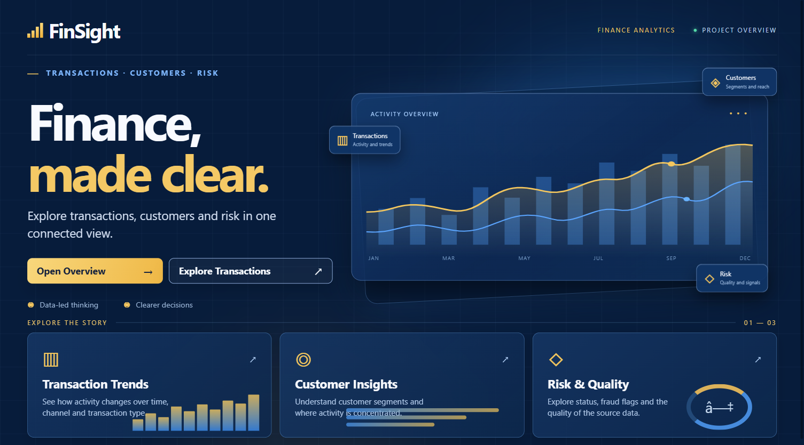
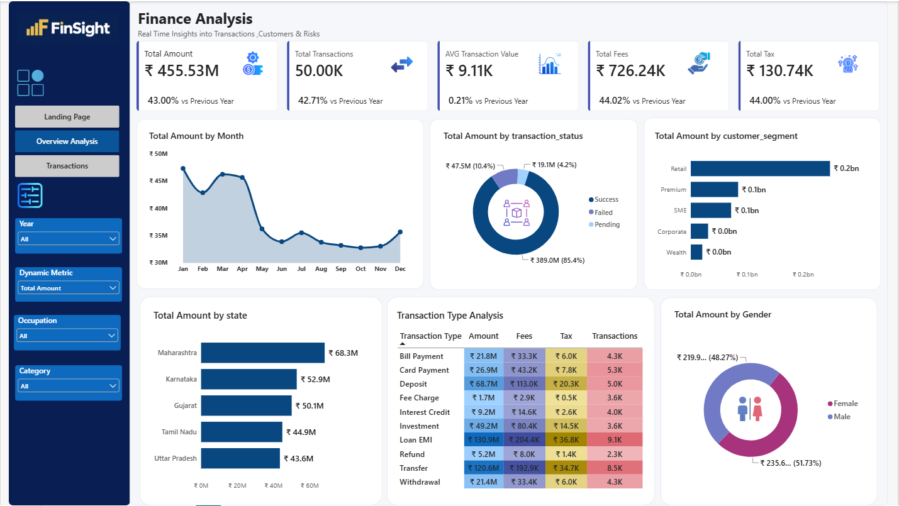
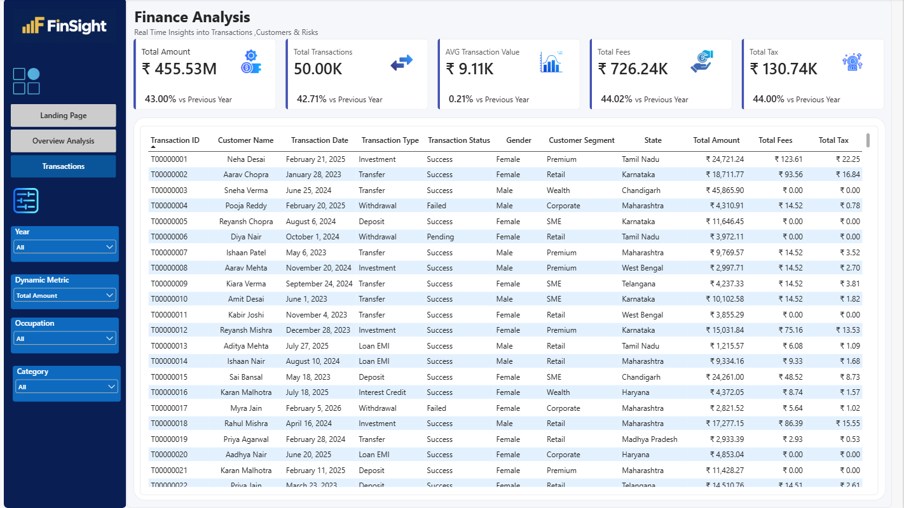
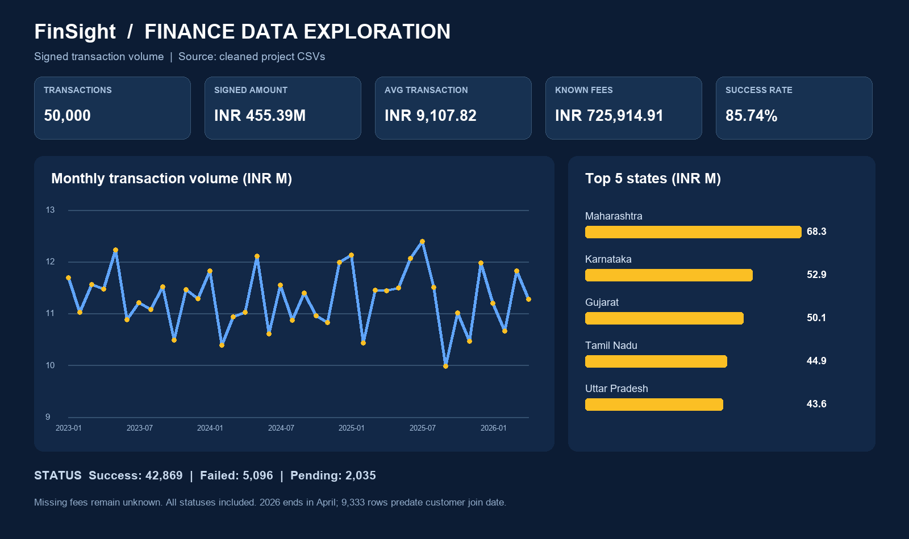
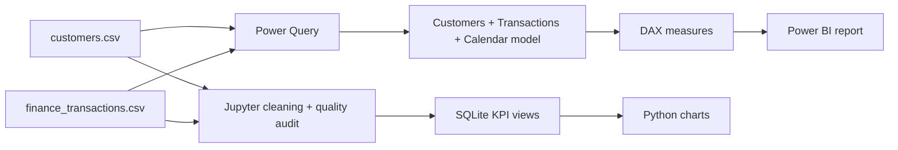

# FinSight · Finance Analysis

**A Power BI case study of transaction activity, customer segments, and data quality.** The project combines a three-page Power BI report with a separate, reproducible Jupyter Notebook and SQLite KPI views.

[](FINANACE%20ANALYSIS%20PROJECT.pbip) [](analysis/Finance_Analysis.ipynb) [](analysis/sql/views.sql)

**Explore:** [Power BI project](FINANACE%20ANALYSIS%20PROJECT.pbip) · [Analysis notebook](analysis/Finance_Analysis.ipynb) · [KPI SQL](analysis/sql/views.sql)



## The business question

How do transaction volume and customer activity change over time, across segments and locations, and by transaction type or status? FinSight brings those views together while keeping data-quality decisions visible. `amount` represents **signed transaction volume, not bank revenue**; fees and tax are separate measures.

## What I built

- **Landing Page:** an entry point to the report and its main analytical sections.
- **Overview Analysis:** KPI cards and year-over-year measures, a monthly trend, transaction-status mix, customer segments, states, transaction types, and gender breakdowns. Year and other slicers support exploration.
- **Transactions:** a transaction-level view with customer and transaction attributes for follow-up.
- **Independent analysis pipeline:** one notebook cleans and audits the source CSVs, creates a local SQLite database and KPI views, and produces static and optional interactive charts. The notebook does not change the Power BI report.

## Power BI dashboard

These are screenshots of the **actual Power BI report**, with no application menus or editing panes. The Overview and Transactions pages below show **Year = All**; the report's slicers and navigation are interactive when opened in Power BI Desktop.

### Overview Analysis



### Transactions



## At a glance

These figures are from the **notebook-cleaned, full-period dataset** (January 2023–April 2026), across all transaction statuses. Dashboard figures can differ when a year or other filter is selected, and its Power Query cleaning policy is different (see [interpretation notes](#interpretation-notes)).

| Metric | Result | Definition |
| --- | ---: | --- |
| Transactions | **50,000** | Unique transaction IDs after reviewed deduplication |
| Customers | **5,000** | Unique customer IDs |
| Signed transaction volume | **₹455.39M** | Sum of `amount`, including negative values |
| Average transaction value | **₹9,107.82** | Signed volume ÷ transaction count |
| Successful transactions | **42,869 (85.74%)** | Status = `Success` ÷ all transactions |
| Known fees | **₹725,914.91** | Sum of observed fee values; missing fees stay unknown |

### Analysis preview



*This is a chart generated by the Jupyter Notebook, not a screenshot of the Power BI report. The chart uses the full dataset; the dashboard supports interactive filters.*

## Data model and workflow



The report models customers at one row per `customer_id`, with many transactions per customer. A calendar table supports time analysis. The [SQL views](analysis/sql/views.sql) cover KPI overview, monthly trends, status, customer segment, top states, transaction type, channel, and risk/quality checks.

### Quality decisions

The notebook parses source dates as `dd-mm-yyyy` and keeps IDs as text. It removes **68 excess exact duplicate rows**, then resolves one inspected duplicate transaction ID (`T00000009`) by retaining the row with the observed ₹21.19 fee. It keeps **8 negative amounts** and **23 missing fees** instead of silently converting either. There are **no orphan transaction/customer keys**. Another **9,333 transactions predate their customer's recorded `join_date`**; these are flagged for business review, not deleted. See the [analysis notes](analysis/README.md) and generated `analysis/output/quality_report.json` after running the notebook.

## Run the project

1. Clone this repository and open `FINANACE ANALYSIS PROJECT.pbip` in Power BI Desktop.
2. The current semantic model contains absolute CSV paths from the author's machine. In **Transform data → Power Query**, update the `Source` file paths for `customers.csv` and `finance_transactions.csv` to your cloned folder, then refresh.
3. To reproduce the independent Python/SQL analysis, run from the repository root:

   ```powershell
   python -m pip install -r analysis/requirements.txt
   python -m jupyter lab
   ```

4. Open `analysis/Finance_Analysis.ipynb` and run the cells from top to bottom. Outputs appear in `analysis/output/` and are ignored by Git. Plotly adds an optional interactive HTML chart; the static PNG works with Pillow.

You can explore the generated SQLite database with, for example:

```sql
SELECT * FROM v_kpi_overview;
SELECT * FROM v_monthly_trends ORDER BY month;
SELECT * FROM v_state_top5;
```

## Repository guide

| Path | Contents |
| --- | --- |
| `FINANACE ANALYSIS PROJECT.pbip` + `.Report/` + `.SemanticModel/` | Power BI report and semantic model |
| `customers.csv`, `finance_transactions.csv` | Original source files |
| `analysis/Finance_Analysis.ipynb` | Python cleaning, validation, SQLite build, and visualization |
| `analysis/sql/views.sql` | Reusable KPI view definitions |
| `analysis/power_query/` | Optional M alternatives; **not applied** to the current report |
| `assets/source_images/` | Original design assets |
| `assets/screenshots/` | Actual Power BI report screenshots used in this README |
| `assets/screenshots/` | Actual Power BI report screenshots used in this README |

## Interpretation notes

- The **Power BI model and notebook are separate analysis paths**. The current report applies `Number.Abs` to `amount` and fills missing fees with `14.52`; the notebook preserves signed amounts and missing fees. Their totals should not be compared as if they share the same cleaning policy.
- The dataset ends on **April 30, 2026**. Compare years using equivalent month windows; 2026 is incomplete.
- `is_fraud` is a source flag and `risk_score` is a recorded score. Neither should be presented as a confirmed fraud outcome or probability without a business definition.

---

Built by [Omar Rezk](https://github.com/OmarRez2) · Power BI · DAX · Power Query · Python · SQL
